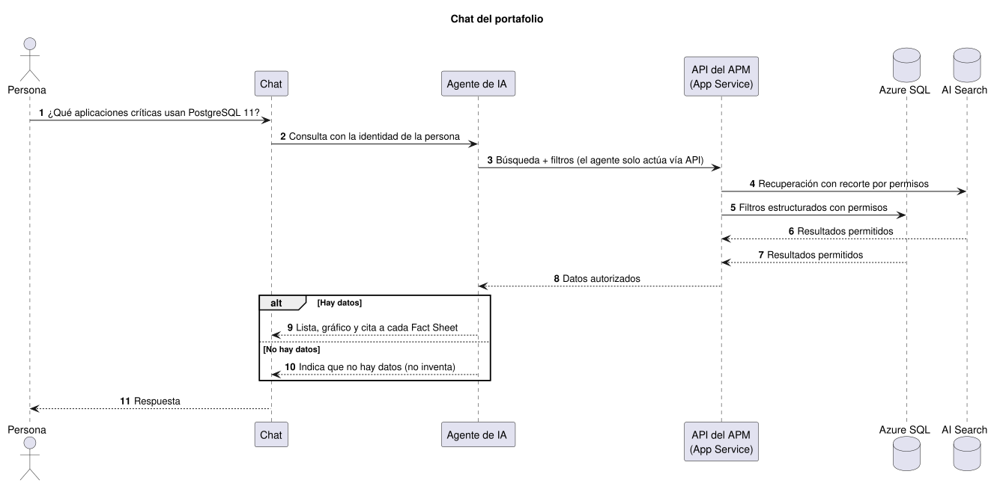
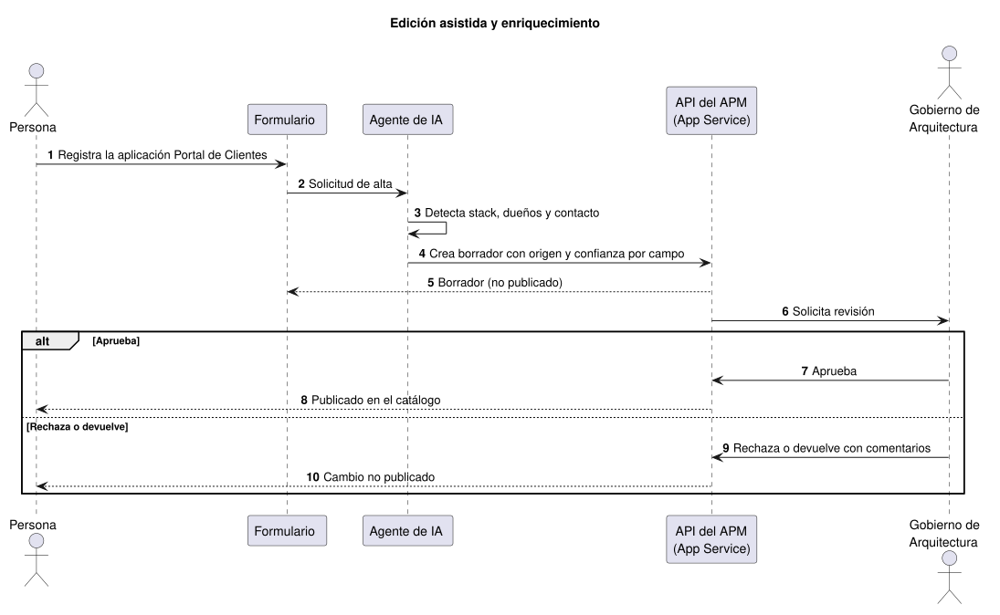
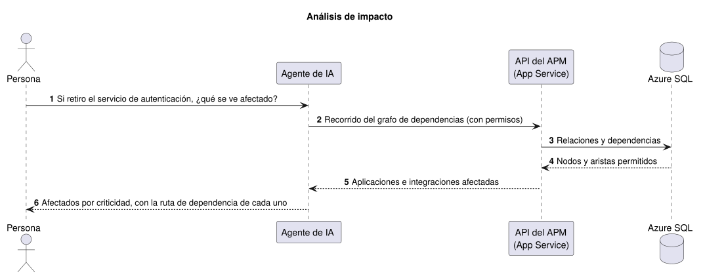
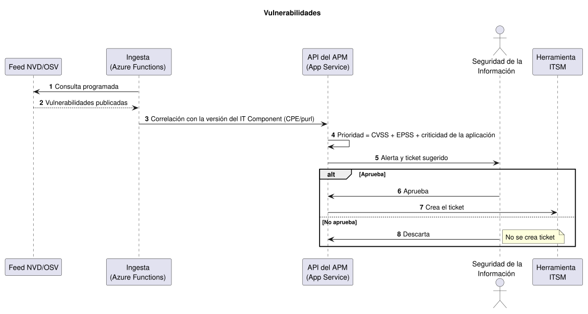
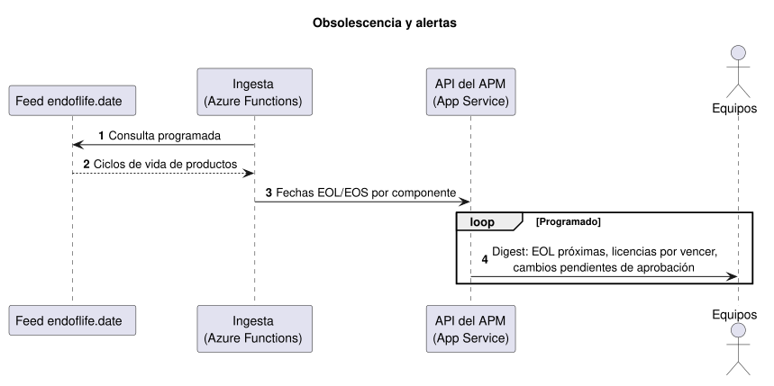
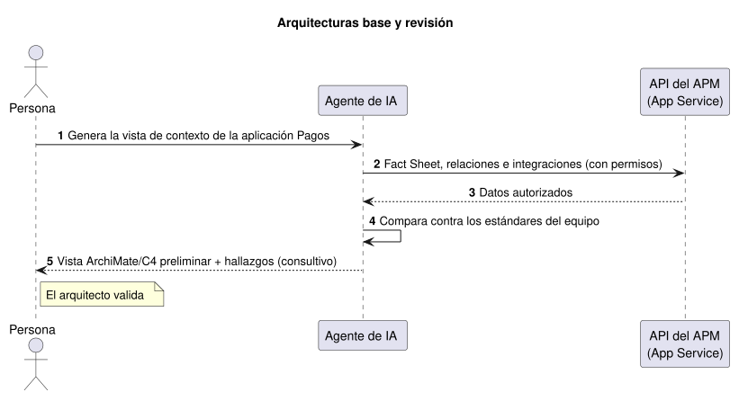
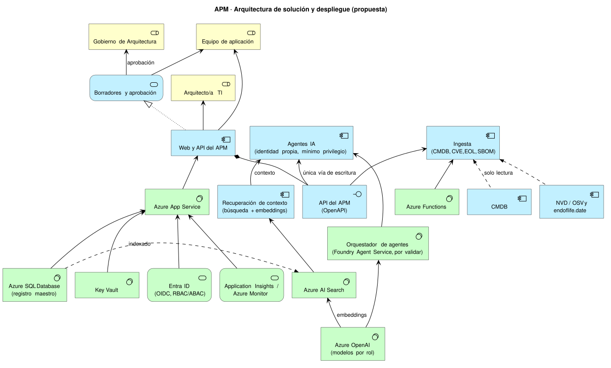

:::note[Propuesta]
Esta página describe una **arquitectura propuesta**, no una implementación existente. Los servicios y modelos nombrados son candidatos sujetos a validación (marcados "por validar") y a las decisiones de la fase correspondiente del [roadmap](./roadmap/).
:::

## Vista rápida

Resumen a muy alto nivel de cómo se usa el APM, cómo actúa la IA y de dónde llegan los datos. El detalle está en las secciones siguientes.

```text
 USO
 ┌────────────────────────────┐
 │ Arquitectos y equipos      │   portal web · chat · Teams (opcional)
 └─────────────┬──────────────┘
               │ inicio de sesión (Entra ID)
               ▼
 ┌────────────────────────────┐   herramientas   ┌──────────────────────┐
 │ API del APM (App Service)  │◄─────────────────┤ Agentes de IA        │
 │ única puerta de entrada    │                  │ (Azure OpenAI)       │
 │ para personas y agentes    ├─────────────────►│ responden con citas  │
 └──────┬──────────────▲──────┘     contexto     └──────────────────────┘
        │              │         (con permisos)
        ▼              │
 ┌──────────────┐   ┌──┴───────────┐
 │ Azure SQL    ├──►│ AI Search    │   índice sin datos Restringidos
 │ registro     │   │ búsqueda con │
 │ maestro      │   │ permisos     │
 └──────▲───────┘   └──────────────┘
        │ cada dato llega con su procedencia
 ┌──────┴─────────────────────────────┐
 │ INGESTA (Azure Functions)          │
 │ Excel · CMDB · CVE · EOL · SBOM    │
 └────────────────────────────────────┘
```

- **Uso:** las personas entran con su cuenta corporativa y trabajan siempre a través de la API del APM.
- **IA:** los agentes no tocan la base de datos. Piden contexto a la API, que solo les entrega lo que la persona puede ver, y responden citando los registros usados.
- **Ingesta:** los datos externos entran por funciones programadas y cada valor guarda su procedencia (fuente, método, fecha).

Cuando un agente sugiere un cambio, este nunca se publica directamente:

```text
Agente sugiere ──► Borrador ──► Gobierno de Arquitectura aprueba ──► Publicado
                                      │
                                      └──► Rechaza o devuelve
```

## Funcionalidades

Cómo responde el sistema en las funcionalidades principales. Cada flujo pasa por la API del APM y respeta los permisos de quien consulta. La lista completa está en [IA agéntica y funcionalidades](./ia-agentes/).

### Chat del portafolio

_Ejemplo: «¿Qué aplicaciones críticas usan PostgreSQL 11?»_



### Edición asistida y enriquecimiento

_Ejemplo: «Registra la aplicación Portal de Clientes»_



### Análisis de impacto

_Ejemplo: «Si retiro el servicio de autenticación, ¿qué se ve afectado?»_



### Vulnerabilidades



### Obsolescencia y alertas



### Arquitecturas base y revisión

_Ejemplo: «Genera la vista de contexto de la aplicación Pagos»_



## Vista de despliegue



## Componentes

| Capa | Componente | Responsabilidad |
|---|---|---|
| Aplicación | **Azure App Service** | Web y API del APM (OpenAPI). Única vía de lectura/escritura para personas, agentes e ingesta |
| Datos | **Azure SQL Database** | Registro maestro: Fact Sheets, relaciones, procedencia por atributo, estados del flujo de aprobación y bitácora de auditoría (ver [Modelo de datos](./modelo-datos/) y [Gobierno de datos](./gobierno-datos/)) |
| Identidad | **Entra ID** | OIDC/SSO, RBAC/ABAC; identidades administradas (*managed identity* o *service principal*) por agente |
| Secretos | **Key Vault** | Secretos y claves; sin credenciales en el catálogo |
| Red | *Private endpoints* / integración con VNet | Los servicios de datos e IA no se exponen a Internet |
| Observabilidad | **Application Insights / Azure Monitor** | Trazas, métricas y alertas |
| IA | **Azure OpenAI** | Servicio de modelos |
| IA | **Azure AI Foundry Agent Service** (o equivalente, por validar) | Orquestación de agentes |
| IA | **Azure AI Search** | Índice para recuperación de contexto (RAG) |
| Ingesta | **Azure Functions** (temporizador/cola) o Data Factory | Migración, sincronización y feeds |
| Canal opcional | Copilot Studio / Teams (por validar) | Acceso al chat desde herramientas corporativas |

## Capa de IA

### Reglas de actuación de los agentes

- Los agentes **solo actúan a través de la API del APM** (herramientas OpenAPI); nunca escriben directo en la base de datos.
- Cada agente tiene **identidad propia** y **mínimo privilegio**: solo las herramientas y los alcances que su función requiere.
- Toda escritura crea un **Borrador** con procedencia y confianza, que entra a la bandeja de aprobación (estados y roles en [Gobierno de datos](./gobierno-datos/#flujo-de-registro-descentralizado)). Ningún agente publica por sí mismo.
- Un agente opera con los permisos del usuario que lo invoca o con su propia identidad de menor alcance, nunca con la unión de ambos.

### Modelos por rol

| Rol | Uso | Modelo |
|---|---|---|
| Razonamiento / chat | Agentes y chat del portafolio | Modelo de chat/razonamiento de Azure OpenAI (versión por validar) |
| Pequeño | Clasificación y extracción | Modelo pequeño de Azure OpenAI (versión por validar) |
| Embeddings | Indexación y búsqueda semántica | Familia `text-embedding-3` (small/large), listada en el catálogo de Microsoft |

El catálogo de modelos cambia con frecuencia ([Microsoft Learn: modelos de Azure](https://learn.microsoft.com/en-us/azure/foundry/foundry-models/concepts/models-sold-directly-by-azure)), por lo que las versiones concretas se eligen con **evals** del propio APM. Reglas: **versión fijada** (*pinning*) por entorno y **compuerta de evals** antes de cualquier actualización de modelo.

### Recuperación de contexto (RAG)

1. Azure AI Search se alimenta desde Azure SQL (indexador con seguimiento de cambios) y genera embeddings.
2. **Recorte de seguridad** (*security trimming*): cada consulta hereda los permisos del usuario y solo recupera lo que ese usuario puede ver.
3. **Filtro por clasificación**: `Restringido` nunca se indexa; `Confidencial` solo se recupera para roles autorizados.
4. La búsqueda se combina con **consultas estructuradas a la API** (por ejemplo, el grafo de dependencias), que la búsqueda semántica no resuelve bien.

## Ingesta

| Fuente | Mecanismo | Fase |
|---|---|---|
| Excel (migración única) | Carga por lotes como `Borrador`; ver [Migración del Excel](./gobierno-datos/#migración-del-excel) | F1 |
| CMDB | Sincronización de solo lectura, por clave de CI | F3 |
| NVD / OSV (CVE) y endoflife.date (EOL) | Función programada; propuesta por validar | F2 |
| SBOM y repositorios | Descubrimiento continuo | F3 |

Toda ingesta registra **procedencia** (fuente, método, fecha, autor). El contenido externo se trata como **no confiable** (defensa contra *prompt injection*): se sanea, nunca se ejecutan instrucciones halladas en los datos y los agentes solo pueden invocar herramientas de una lista permitida.

## Flujos de comportamiento

**1. Pregunta en el chat**

1. La persona se autentica (Entra ID).
2. El agente recupera contexto con recorte de permisos y consultas a la API.
3. Responde con **citas** a los Fact Sheets o fuentes usadas.
4. Se registran pregunta, herramientas invocadas y respuesta.

**2. Sugerencia de cambio a un Fact Sheet**

1. El agente propone el cambio mediante la API.
2. Se crea un Borrador con procedencia y puntaje de confianza.
3. Gobierno de Arquitectura aprueba, rechaza o devuelve.
4. Si se aprueba, se publica; todo el recorrido queda en la auditoría.

**3. Ingesta de CVE**

1. La función programada obtiene el CVE y lo guarda con su procedencia.
2. Se correlaciona con la versión del IT Component (CPE/purl).
3. Se prioriza combinando CVSS, EPSS y criticidad de la aplicación.
4. El ticket sugerido en la herramienta de ITSM **requiere aprobación** antes de crearse.

## Clases de datos

| Clase | Azure SQL | Índice de búsqueda | Prompt del modelo | Registros (logs) |
|---|---|---|---|---|
| Público | Sí | Sí | Sí | Sí |
| Interno | Sí | Sí | Sí, para usuarios autorizados | Sí |
| Confidencial | Sí | Solo con filtro por rol | Solo para roles autorizados | Enmascarado |
| Restringido | **No se carga** (secretos, datos de clientes, datos personales sensibles) | **Nunca** | **Nunca** | Omitido; la ingesta lo descarta |

La clasificación es una propuesta; los valores exactos se confirman con Seguridad de la información (por validar).

## Riesgos de la IA y contramedidas

Qué podría hacer mal la IA y cómo lo impide la arquitectura. Cada riesgo tiene una **prevención** (lo que el diseño bloquea por construcción) y una **detección y respuesta** (cómo se nota si ocurre y qué se hace). Los umbrales son propuestas que se calibran en el piloto.

| # | Riesgo | Cómo podría ocurrir | Prevención | Detección y respuesta |
|---|---|---|---|---|
| 1 | **Saltarse la aprobación de Gobierno de Arquitectura** | Un agente intenta publicar un cambio gobernado, o encadena llamadas para cambiar el estado de un Fact Sheet a `Aprobado` | La identidad del agente no tiene permiso de publicar ni de aprobar; la API solo le permite crear `Borrador`. El estado `Aprobado` exige un aprobador humano registrado, distinto de quien propone | Alerta ante cualquier publicación sin aprobador (KPI: 100 % de cambios con aprobador). Si ocurre, se activa el nivel 2 del [mecanismo de detención](#mecanismo-de-detención) (solo lectura) y se revisa la bitácora |
| 2 | **Exceder los permisos de la persona** | El agente usa su propia identidad para leer o mostrar datos que la persona no puede ver | Permisos heredados (*on-behalf-of*): el agente actúa con los permisos de quien consulta o con los suyos, nunca con la unión de ambos. Mínimo privilegio por agente | Revisión periódica de la matriz de permisos por Seguridad de la Información; las llamadas fuera de alcance se rechazan y se registran |
| 3 | **Exponer datos sensibles** | Una respuesta o un *log* incluye datos Confidenciales para alguien sin rol autorizado | Recorte de seguridad en AI Search, filtro por clasificación; lo Restringido no se carga ni se indexa (ver [Clases de datos](#clases-de-datos)) | Enmascarado en registros; muestreo de respuestas. Ante una fuga se activa el nivel 2 o 3 |
| 4 | **Inventar respuestas (alucinación)** | El modelo responde sin respaldo en el catálogo | Citas obligatorias a Fact Sheets; si no hay datos, el chat lo dice | KPI de precisión con cita (meta ≥ 90 %). Por debajo de 80 % se pasa a solo lectura y se revisa el agente |
| 5 | **Obedecer instrucciones ocultas en los datos (*prompt injection*)** | Un CVE, un repositorio o un campo de texto ingerido contiene instrucciones para el agente | El contenido externo se trata como no confiable: se sanea, nunca se ejecutan instrucciones halladas en los datos y solo se invocan herramientas de una lista permitida. Filtros de contenido del servicio de modelos | Registro de llamadas a herramientas; una llamada fuera de la lista se bloquea y genera alerta |
| 6 | **Ejecutar acciones externas no autorizadas** | El agente crea tickets en ITSM o actúa sobre otros sistemas por su cuenta | Las acciones externas son sugerencias: el ticket solo se crea tras aprobación. Cuenta de servicio con permisos acotados; sin escritura en sistemas productivos | Cada acción externa queda registrada; revocar las herramientas del agente (nivel 1) |
| 7 | **Aprobaciones en automático (sesgo de automatización)** | Los revisores aprueban en un clic sin leer, o se saturan con la carga inicial | Diferencias antes/después visibles, confianza por campo, carga por lotes priorizados | Métrica de aprobación sin edición y tiempo de revisión; segunda revisión por muestreo |
| 8 | **Cambiar de comportamiento con una nueva versión del modelo** | El proveedor actualiza el modelo y empeora la calidad o cambia el formato | Versión fijada por entorno; compuerta de evals antes de cualquier actualización | Evals ejecutadas en cada cambio de modelo, *prompt* o herramienta; reversión a la versión anterior |
| 9 | **Costos o bucles sin control** | Un agente entra en un ciclo de llamadas o el descubrimiento continuo consume de más | Límite de pasos por ejecución, límites de tasa por usuario y agente, presupuesto por agente | Alerta al 80 % del presupuesto; detener el agente (nivel 1) |
| 10 | **Borrar o alterar la trazabilidad** | Un agente intenta modificar la bitácora para ocultar un cambio | La bitácora es de solo anexado; ningún agente tiene permiso de escritura sobre ella | Acceso de solo lectura para auditoría; verificación de integridad de la bitácora |
| 11 | **Decidir sobre personas o retiros por su cuenta** | Las recomendaciones de racionalización se aplican sin revisión o se usan para evaluar equipos | Los análisis y escenarios *what-if* son consultivos; un agente solo puede proponer un cambio de ciclo de vida o una baja como `Borrador`, que pasa por aprobación | Etiqueta de uso consultivo en cada salida; revisión por muestreo de Gobierno de Arquitectura |

La regla de fondo es que **la IA propone y la persona dispone**: los controles 1, 6 y 11 la hacen cumplir en la API, no solo en la interfaz, de modo que un agente no pueda saltársela llamando directamente a la API.

## Operación y seguridad

| Tema | Propuesta |
|---|---|
| Registro | Prompts, salidas y llamadas a herramientas; historial de conversaciones con retención de **90 días** (propuesta) |
| Filtros y límites | Filtros de contenido del servicio de modelos, límites de tasa por usuario/agente y alertas de presupuesto |
| Entornos | `dev`, `test` y `prod`, con recursos y datos separados |
| CI/CD | Infraestructura como código y *pipeline* por entorno; despliegue a `prod` tras pruebas y evals |
| Evals | Conjunto de casos del APM ejecutado ante cambios de modelo, *prompts* o herramientas |

### Mecanismo de detención

| Nivel | Efecto | Interruptor concreto |
|---|---|---|
| 1. Agente | Se detiene un agente | Deshabilitar la identidad del agente o revocar sus herramientas |
| 2. Solo lectura | Ningún agente puede escribir | Bandera de solo lectura para agentes en la API |
| 3. Sin IA | Se desactiva la capa de IA | La interfaz usa búsqueda simple y filtros; el APM sigue operando |

## Relación con el roadmap

| Fase | Elementos de esta arquitectura |
|---|---|
| F0 | Esta propuesta; infraestructura como código y entornos base |
| F1 | App Service, Azure SQL, Entra ID, Key Vault, observabilidad; migración del Excel |
| F2 | Ingesta de CVE y EOL |
| F3 | Conectores CMDB, SBOM y repositorios |
| F4 | Azure OpenAI, agentes, Azure AI Search, evals, mecanismo de detención |
| F5 | Analítica avanzada e informes sobre la misma base |
