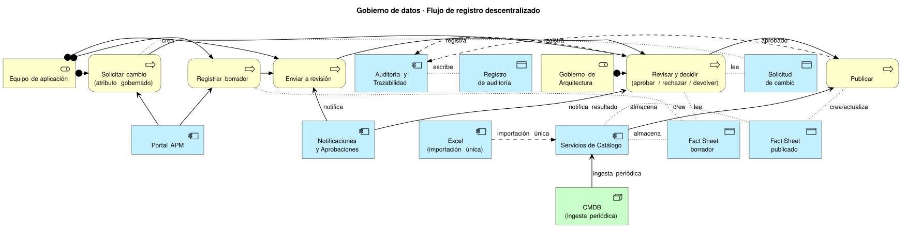

## Enfoque

El APM sigue un modelo **híbrido**: es registro maestro propio para los datos de arquitectura y estrategia, e **ingiere** el resto desde sus fuentes autoritativas. El registro es **descentralizado** — los equipos de aplicación mantienen sus propios Fact Sheets — pero los cambios a atributos con impacto estratégico pasan por la aprobación de **Gobierno de Arquitectura**. Esta página complementa [Modelo de datos (metamodelo)](./modelo-datos/): allí se definen las entidades y atributos; aquí, quién es dueño de cada dato y cómo se aprueba un cambio.

## Fuentes y autoridad

| Fuente | Qué gobierna | Mecanismo |
|---|---|---|
| **APM (registro maestro)** | Aplicaciones, integraciones, capacidades de negocio, relaciones entre Fact Sheets, decisiones de arquitectura (criticidad, TIME, ciclo de vida) | Registro directo por los equipos de aplicación, sujeto a aprobación de Gobierno de Arquitectura para atributos gobernados (ver [flujo de registro](#flujo-de-registro-descentralizado)) |
| **CMDB** | Infraestructura (servidores, contenedores, CIs y su topología) | Conector / ingesta periódica; el APM nunca edita estos atributos, solo los muestra y los referencia (ver [Identidad y reconciliación](#identidad-y-reconciliación-con-cmdb)) |
| **Feeds CVE / EOL** | Vulnerabilidades (CVE) y fechas de fin de vida (EOL) / fin de soporte (EOS) de componentes tecnológicos | Ingesta automática — **propuesta a validar**: NVD para CVE, endoflife.date para EOL/EOS |
| **Excel** | Catálogos actuales de aplicaciones, integraciones y tecnologías | **Solo importación inicial única** (ver [Migración del Excel](#migración-del-excel)); después de la migración deja de ser fuente y se retira |

**Regla de autoridad única:** cada atributo tiene exactamente una fuente autoritativa en un momento dado. Ningún atributo se edita simultáneamente desde dos sistemas: los atributos de infraestructura solo se editan en la CMDB (el APM los ingiere de solo lectura), los atributos de CVE/EOL solo se editan en el feed de origen, y todo lo demás se edita en el APM una vez completada la migración del Excel.

## Procedencia por atributo

Cada valor almacenado en el APM registra su procedencia, para poder auditar y confiar en el dato:

| Campo de procedencia | Descripción |
|---|---|
| Fuente | Sistema o proceso de origen (APM manual, Excel migrado, CMDB, feed de CVE/EOL, agente IA) |
| Método | `manual` (lo escribió una persona), `importación` (carga inicial del Excel), `ingesta` (sincronización periódica desde CMDB o feeds), `propuesta de agente IA` |
| Fecha | Momento en que se registró o actualizó el valor |
| Autor | Persona, conector o agente que generó el valor |
| Confianza | Solo aplica a propuestas de IA; puntaje de confianza del modelo (ver [IA agéntica y funcionalidades](../ia-agentes/)) |
| Estado de validación | `Pendiente`, `Validado por humano`, `Ingerido (no requiere validación de contenido)` |

Esto conecta directamente con el ciclo de datos con IA agéntica descrito en [Arquitectura del sistema](../#ciclo-de-datos-con-ia-agéntica) y en [IA agéntica y funcionalidades](../ia-agentes/): un agente puede **proponer** un valor (por ejemplo, al enriquecer una aplicación recién registrada), pero ese valor queda como **borrador auditado con origen y confianza**, y no se publica hasta que una persona lo valida — *"la IA propone, la persona dispone"*. El campo de procedencia es el mecanismo con el que ese principio se registra dato a dato.

## Flujo de registro descentralizado

### Estados

Un Fact Sheet nuevo, o una propuesta de cambio sobre uno existente, recorre estos estados:

`Borrador` → `En revisión` → `Aprobado` (publicado) / `Rechazado` (con motivo) / `Devuelto` (con observaciones, vuelve a `Borrador`)

### Reglas por clase de atributo

Las tres clases de atributo definidas en [Modelo de datos › Atributos](./modelo-datos/#clasificación-de-gobierno-de-los-atributos-propuesta) determinan cómo se aplica un cambio:

- **Gobernado**: un cambio sobre un atributo gobernado de un Fact Sheet **ya publicado** genera una **solicitud de cambio**. El Fact Sheet publicado sigue vigente y visible tal cual está hasta que Gobierno de Arquitectura aprueba la solicitud; solo entonces se actualiza la versión publicada. El alta y la baja de Fact Sheets también son cambios gobernados y siguen el mismo flujo de aprobación.
- **Operativo**: el responsable del Fact Sheet lo edita directamente, sin pasar por revisión previa. El cambio queda auditado (quién, cuándo, valor anterior) para trazabilidad, pero no bloquea la publicación.
- **Ingerido**: de solo lectura para cualquier persona en el APM; solo cambia cuando la fuente autoritativa (CMDB o feed externo) lo actualiza en la siguiente sincronización.

### Roles

- **Equipo de aplicación**: registra y mantiene sus Fact Sheets (rol Responsible); envía a revisión los borradores y las solicitudes de cambio.
- **Gobierno de Arquitectura**: revisa y decide (Accountable del proceso de aprobación); puede aprobar, rechazar con motivo o devolver con observaciones.
- **Arquitecto/a responsable**: puede coincidir con Gobierno de Arquitectura o actuar como enlace entre el equipo de aplicación y el comité de gobierno, según cómo se organice el equipo.

### Relación con el Quality Seal de LeanIX

LeanIX v4 tiene un mecanismo **verificado** llamado *Quality Seal*: un sello que otorga el rol Responsible/Accountable de un Fact Sheet, y que se **rompe automáticamente** si otra persona lo edita después. Es una marca de calidad retrospectiva, no bloquea la edición ni la visibilidad del Fact Sheet.

El flujo de aprobación de esta página es distinto y complementario: la aprobación de Gobierno de Arquitectura es un **gate previo a la publicación** de un cambio gobernado — mientras la solicitud está pendiente, el dato publicado no cambia. Se puede adoptar el Quality Seal como indicador adicional de calidad sobre un Fact Sheet ya publicado, sin que reemplace este gate de gobierno.

### Pendiente de definir

- **SLA de revisión**: cuánto tiempo tiene Gobierno de Arquitectura para resolver una solicitud. No se define un número aquí; debe acordarse con el equipo de gobierno.
- **Notificaciones**: canales y eventos exactos (¿correo?, ¿en la app?, ¿ambos?) para avisar de una solicitud pendiente, una decisión o un cambio ingerido relevante (ver también el componente "Notificaciones y Aprobaciones" en [Composición de la plataforma](../#composición-de-la-plataforma)).

## Migración del Excel

Pasos propuestos para la migración única del Excel al APM:

1. **Perfilado y limpieza**: revisar los archivos Excel actuales de aplicaciones, integraciones y tecnologías; detectar columnas vacías, formatos inconsistentes y valores fuera de catálogo.
2. **Mapeo columna → atributo del metamodelo**: cada columna del Excel se mapea a un atributo del modelo de datos, usando las tablas de [Modelo de datos › Atributos específicos por tipo](./modelo-datos/#atributos-específicos-por-tipo) como referencia (esas tablas ya indican, para cada atributo, el campo orientativo de [Catálogos del portafolio](./catalogos/) del que proviene).
3. **Reconciliación de duplicados e identidad**: antes de cargar, agrupar filas que representen el mismo Fact Sheet en distintas fuentes o pestañas, usando alias y códigos existentes (ver [Identidad y reconciliación](#identidad-y-reconciliación-con-cmdb)).
4. **Carga inicial**: dos opciones, con distinto costo y riesgo:

   | Opción | Ventaja | Riesgo |
   |---|---|---|
   | Cargar todo como `Borrador` | Simple, un solo tipo de estado inicial | Genera un volumen grande de borradores pendientes de revisión, puede saturar a Gobierno de Arquitectura |
   | Cargar como `Aprobado por migración` | El portafolio queda utilizable de inmediato, sin cola de revisión | Publica datos del Excel sin que nadie los haya validado contra el metamodelo nuevo; riesgo de arrastrar errores previos como si fueran datos gobernados |

   **Recomendación**: cargar por lotes como `Borrador`, agrupados por dominio o equipo, y que Gobierno de Arquitectura los revise en tandas priorizadas (por ejemplo, aplicaciones críticas primero) en vez de una revisión masiva simultánea. Esto conserva el control de calidad del flujo de aprobación sin bloquear la disponibilidad del resto del portafolio, que puede consultarse igual mientras está en borrador.
5. **Congelar y retirar el Excel**: una vez migrados y revisados los datos, el Excel pasa a solo lectura como archivo histórico y se retira como fuente operativa; no vuelve a sincronizarse con el APM.

## Identidad y reconciliación con CMDB

- Cada Fact Sheet tiene un **identificador estable propio del APM** (UUID, ver [Modelo de datos › Atributos base](./modelo-datos/#atributos-base-comunes-a-todo-fact-sheet)), que no depende de ningún sistema externo.
- Además, guarda **claves externas** hacia los sistemas de origen: alias/códigos de reconciliación (para el Excel migrado) y el **CI de CMDB** (para IT Components de infraestructura).
- **Reglas de matching** (propuesta, a validar con el equipo de CMDB): cruce por CI de CMDB cuando existe; si no, por alias/código normalizado; si no, por nombre normalizado + tipo de Fact Sheet como último recurso, siempre marcado de menor confianza.
- **Conflictos** (por ejemplo, dos CIs de CMDB que podrían corresponder a la misma aplicación, o un alias que matchea más de un Fact Sheet) no se resuelven automáticamente: se envían a una **cola de revisión humana** para que un arquitecto decida la reconciliación correcta.

Páginas relacionadas: [Modelo de datos (metamodelo)](./modelo-datos/), [Catálogos del portafolio](./catalogos/), [IA agéntica y funcionalidades](../ia-agentes/).
