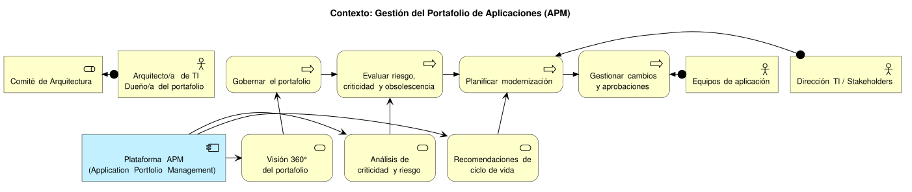
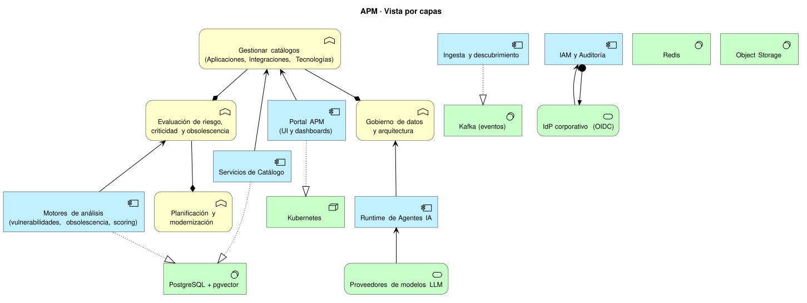
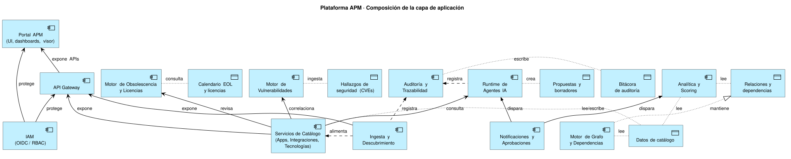
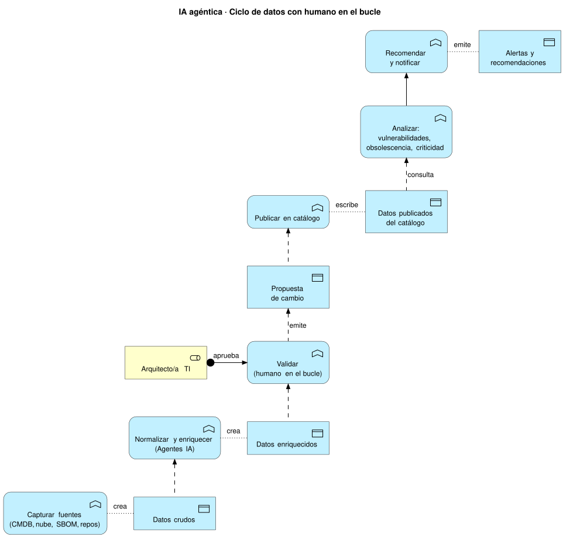
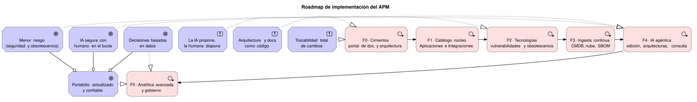

## Visión general

El APM es un sistema para que el equipo de **Arquitectura TI** gobierne el portafolio de aplicaciones con ayuda de **IA agéntica**. La arquitectura se modela en **ArchiMate 3.2** y se governa como código (PlantUML): los diagramas se revisan en *pull request*, se versionan y se publican automáticamente en este portal con cada despliegue.

Los diagramas fuente viven en `docs/arquitectura/diagramas/*.puml` y se regeneran con `npm run diagrams` (ver [guía de diagramas](../guias/diagramas/)).

## Contexto de negocio

El sistema sirve a arquitectos, equipos de aplicación y dirección: mantiene el portafolio gobernado y actualizado, evalúa riesgo y obsolescencia, y soporta la planificación de modernización con aprobaciones formales.

## Vista por capas

La solución se organiza en negocio, aplicación y tecnología. La capa de aplicación contiene los catálogos, los motores de análisis y el runtime de agentes IA; la capa de tecnología provee la plataforma de datos, event-driven y los modelos LLM.

## Composición de la plataforma

Doce componentes de aplicación y sus objetos de datos: catálogos y grafos de dependencias, ingesta, agentes IA, motores de vulnerabilidades y obsolescencia, analítica, notificaciones, IAM y auditoría.

## Ciclo de datos con IA agéntica

Todo dato que toca la IA sigue un ciclo con **humano en el bucle**: captura → enriquecimiento por agentes → validación → publicación → análisis → recomendaciones. Cada paso queda auditado.

## Roadmap

Páginas relacionadas:

- [Catálogos del portafolio](./catalogos/)
- [IA agéntica y funcionalidades](./ia-agentes/)
- [Roadmap de implementación](./roadmap/)