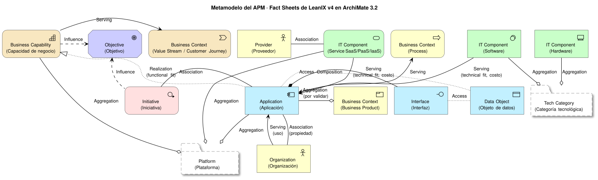

## Enfoque

El modelo de datos del APM toma como base el **SAP LeanIX Meta Model v4** (tipos de *Fact Sheet* y sus relaciones) y lo expresa en notación **ArchiMate 3.2**, consistente con el resto de diagramas de este portal.

El APM es un **registro maestro híbrido**: es dueño y fuente de verdad de la estrategia (mantener/invertir/contener/retirar), la criticidad, las capacidades de negocio, las relaciones entre elementos y las decisiones de arquitectura. El resto de los datos (inventario técnico, versiones, vulnerabilidades, etc.) se **ingiere de fuentes externas** con un proceso de reconciliación y procedencia por atributo, detallado en una fase posterior (ver tarea T2).

> **Nota importante:** SAP LeanIX **no publica un mapeo oficial** de tipos de Fact Sheet a elementos ArchiMate. La correspondencia presentada en esta página es una **propuesta de este proyecto**, construida a partir de la semántica de cada tipo de Fact Sheet y las definiciones del estándar ArchiMate 3.2. Debe validarse contra un workspace real de LeanIX o su documentación oficial antes de tomarse como definitiva.

## Diagrama

El diagrama muestra un subconjunto ilustrativo de tipos y relaciones; la tabla completa de tipos y la tabla completa de relaciones están más abajo.

## Tabla de tipos: Fact Sheet → ArchiMate

| Fact Sheet (LeanIX v4) | Elemento ArchiMate | Capa | Catálogo actual que lo cubre | Subtipos |
|---|---|---|---|---|
| Application | Application Component | Aplicación | Aplicaciones | por confirmar |
| Interface | Application Interface (+ relación *Flow* entre aplicaciones) | Aplicación | Integraciones | por confirmar |
| Data Object | Data Object | Aplicación | Integraciones / Datos (extendido) | por confirmar |
| IT Component | Software → System Software; Hardware → Device/Node; Service (SaaS/PaaS/IaaS) → Technology Service | Tecnología | Tecnologías y componentes | Software, Hardware, Service (SaaS/PaaS/IaaS) — probable, por confirmar |
| Tech Category | Grouping | Compuesto | Tecnologías | por confirmar |
| Provider | Business Actor | Negocio | Proveedores (extendido) | por confirmar |
| Business Capability | Capability | Estrategia | Capacidades (extendido) | por confirmar |
| Business Context | Process → Business Process; Value Stream → Value Stream; Business Product → Product; Customer Journey → Value Stream | Negocio/Estrategia | — | Business Product, Customer Journey, Process, Value Stream |
| Organization | Business Actor | Negocio | Datos generales (propietario, equipo) | por confirmar |
| Objective | Goal | Motivación | — | por confirmar |
| Initiative | Work Package | Implementación y migración | Iniciativas (extendido) | Idea, Program, Project, Epic |
| Platform | Grouping | Compuesto | — | por confirmar |

Notas sobre la tabla:

- **IT Component** e **Interface** no tienen una correspondencia 1 a 1: el elemento ArchiMate depende del subtipo (IT Component) o se acompaña de una relación adicional (Interface, con *Flow* entre las aplicaciones proveedora y consumidora).
- **Business Context** agrupa cuatro subtipos de LeanIX (Business Product, Customer Journey, Process, Value Stream) que se reparten entre tres tipos de elemento ArchiMate distintos (Business Process, Value Stream, Product), porque representan conceptos de capas diferentes (proceso operativo vs. propuesta de valor vs. producto).
- Los subtipos marcados "por confirmar" no se pudieron verificar contra fuentes primarias de LeanIX (ver [Fuentes y límites](#fuentes-y-límites)).

## Tabla de relaciones: LeanIX → ArchiMate

| Relación LeanIX | Relación ArchiMate | Atributos de la relación |
|---|---|---|
| Application → Business Capability | Realization | functional fit |
| Application → Business Context | Serving | — |
| Application compone su Interface proveedora | Composition | — |
| Interface → aplicación consumidora | Serving (y *Flow* proveedora→consumidora — **por validar**) | — |
| Application / Interface → Data Object | Access | — |
| IT Component → Application | Serving | technical fit, costo |
| Tech Category → IT Component | Aggregation | — |
| Provider → IT Component | Association | — |
| Application → Organization (uso) | Serving | — |
| Application → Organization (propiedad/responsabilidad) | Association | — |
| Initiative → elementos afectados | Association | — |
| Initiative → Objective | Influence | — |
| Business Capability → Objective | Influence | — |
| Platform → Application / IT Component / Business Capability | Aggregation | — |
| Jerarquías padre/hijo (Business Capability, Application, Organization, Business Context, IT Component) | Composition | — |

Estas parejas se contrastaron contra las reglas de derivación de ArchiMate 3.2: Realization e Influence son las relaciones designadas por el estándar para cruzar hacia las capas de Estrategia, Motivación e Implementación (por eso Application → Business Capability usa Realization, e Initiative/Business Capability → Objective usan Influence), Association es válida entre cualquier par de elementos, y Grouping puede agregar elementos de cualquier capa. La única pareja marcada **por validar** es *Interface → aplicación consumidora (Flow)*: el Flow entre dos elementos estructurales (Application Interface y Application Component) es una práctica común en herramientas de modelado, pero no se pudo confirmar contra la tabla normativa del Apéndice B de la especificación (bloqueada por autenticación al momento de esta investigación). Si una revisión posterior encuentra una pareja incompatible, se debe corregir aquí y regenerar el diagrama en vez de forzar una relación no soportada por el estándar.

## Atributos estándar verificados

Estos aspectos transversales de LeanIX se confirmaron contra documentación oficial de SAP y del modelo TIME de Gartner:

- **Ciclo de vida**: fases `plan` → `phaseIn` → `active` → `phaseOut` → `endOfLife`, cada una con su propia fecha de inicio.
- **TIME** (Tolerate / Invest / Migrate / Eliminate): se deriva de cruzar *functional fit* × *technical fit* de una aplicación (matriz de racionalización del portafolio).
- **Quality Seal**: sello de aprobación otorgado por el rol Responsible/Accountable de un Fact Sheet; se rompe automáticamente si otra persona edita el Fact Sheet después del sello.
- **Completion score**: porcentaje de completitud de un Fact Sheet, configurable por tipo y por campo.

El conjunto completo de atributos por entidad y el modelo de procedencia/fuente autoritativa por atributo se definen en la tarea T2.

## Extensiones propias del APM

Estas capacidades están fuera del metamodelo estándar de LeanIX y se detallarán en T2:

- Vulnerabilidades (CVE) vinculadas a la versión específica de un IT Component.
- Calendario de fin de vida (EOL) y fin de soporte (EOS).
- Licencias y su estado.
- Procedencia y fuente autoritativa por atributo (qué sistema es dueño de cada dato y cómo se reconcilia).

## Fuentes y límites

- [TIME model — SAP LeanIX docs](https://help.sap.com/docs/leanix/ea/time)
- [Quality Seal — SAP LeanIX docs](https://help.sap.com/docs/leanix/ea/quality-seal)
- [Gartner TIME model — LeanIX wiki](https://www.leanix.net/en/wiki/apm/gartner-time-model)
- [ArchiMate 3.2 Specification — The Open Group](https://pubs.opengroup.org/architecture/archimate32-doc/)

**Límite de la investigación:** la lista completa de tipos y subtipos del Meta Model v4, así como las escalas exactas de criticidad y de *fit* (functional/technical), no pudieron verificarse contra fuentes primarias porque la documentación de LeanIX se renderiza con JavaScript y no fue accesible para extracción automática en esta iteración. Estos puntos deben confirmarse contra un workspace real de LeanIX o su documentación oficial antes de considerarse definitivos.

Páginas relacionadas: [Catálogos del portafolio](./catalogos/).
